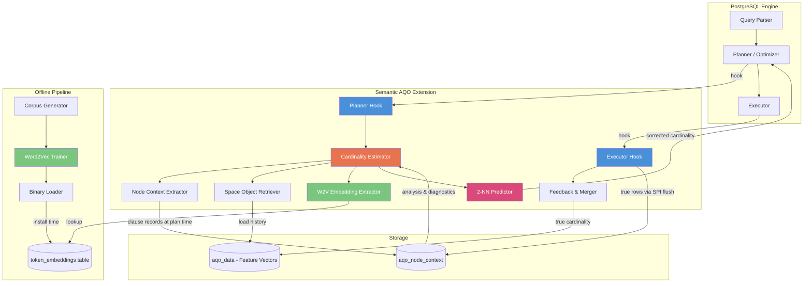
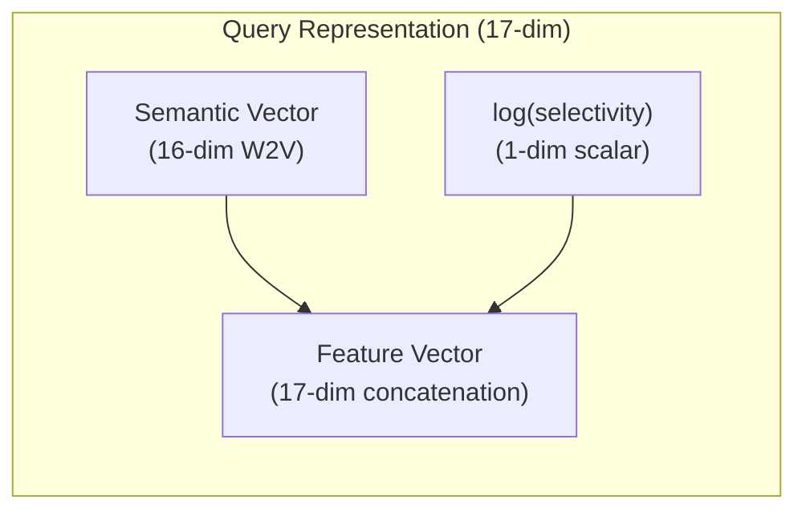
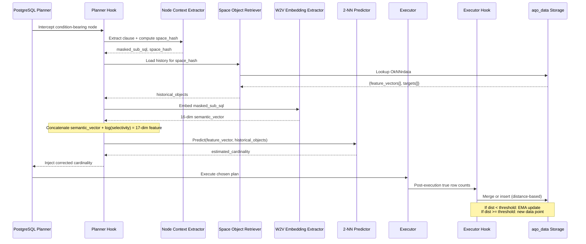
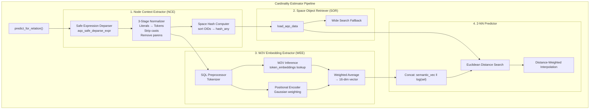
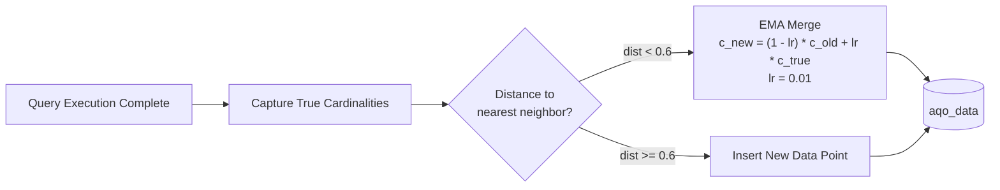
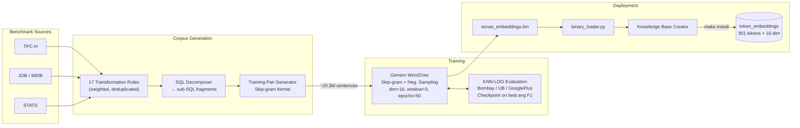
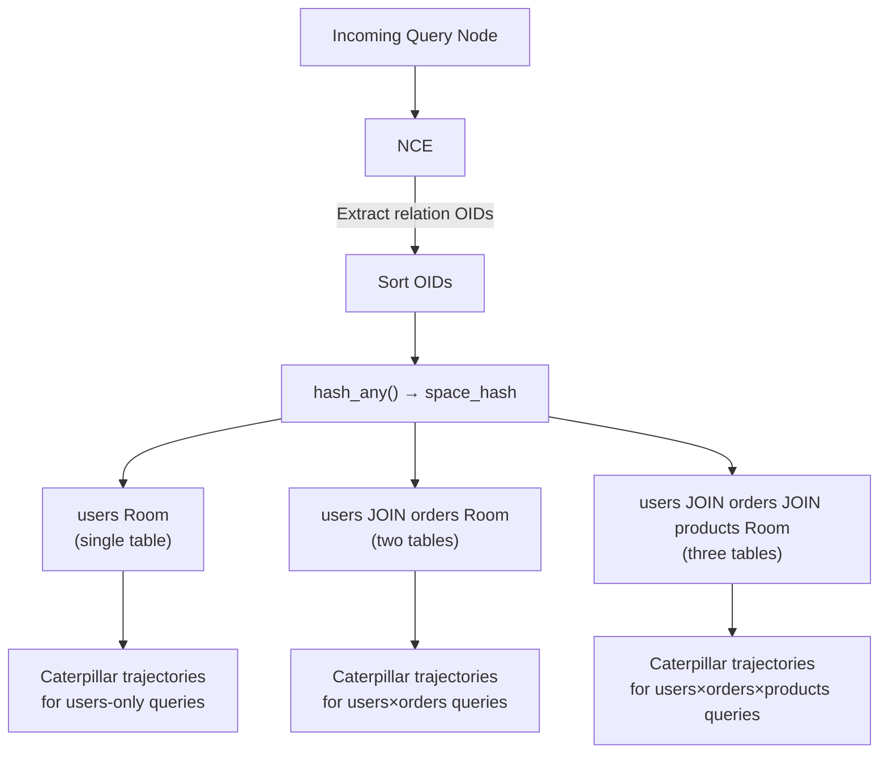

# Semantic AQO Architecture

## 1. Problem Statement

PostgreSQL's default query optimizer computes joint selectivity under the **Attribute Value Independence (AVI)** assumption - treating each column's distribution as entirely uncorrelated. This causes cardinality misestimates that cascade through join ordering, index selection, and memory allocation. The upstream **AQO 3-NN** extension addresses this via historical k-NN correction, but suffers from rigid feature-subspace partitioning that fails on novel query shapes.

**Semantic AQO (SAQO)** introduces a semantic awareness layer into the cardinality estimation pipeline, using Word2Vec embeddings to capture structural relationships between query predicates, enabling generalization to unseen query patterns.

## 2. High-Level System Overview

## 3. Core Concept: The Caterpillar Model

The central insight that drives the architecture:

- **Literal masking** ensures structurally identical queries (e.g., `age > 25` vs `age > 50`) produce the **same** W2V embedding.
- The selectivity scalar **stretches** these identical structures along a continuous axis.
- The result: queries of the same template form **"caterpillar" trajectories** in the 17-dim space.
- **2-NN** finds the two nearest points that bracket the new query on its caterpillar, then interpolates.

## 4. Query Lifecycle Through SAQO

## 5. Module Architecture

### 5.1 Planner-Side Modules

### 5.2 Executor-Side Module

### 5.3 Offline W2V Pipeline

## 6. Data Flow: Space & Room Routing

Queries are **isolated by relational structure**: a query touching `{users}` will never be compared against one touching `{users, orders}`. Within each Room, structurally similar queries form caterpillar trajectories stretching along the selectivity axis.

## 7. Source Code Map

### 7.1 PostgreSQL C Extension (Semantic Layer - Our Code)

| File | Role |
|------|------|
| `cardinality_estimation.c` | Central orchestrator - `predict_for_relation()`, builds 17-dim feature vector |
| `path_utils.c/h` | Safe expression tree walker (`aqo_safe_deparse_expr`), on-the-fly embedding via `aqo_compute_embedding` |
| `node_context.c/h` | NCE: clause deparsing, 3-stage normalization, space_hash, memory management, SPI flush |
| `machine_learning.c/h` | `OkNNr_predict` (2-NN interpolation), `OkNNr_learn` (EMA merge, threshold=0.6, lr=0.01) |
| `w2v_inference.c/h` | One-time load of `token_embeddings` into flat arrays, lookup functions |
| `w2v_embedding_extractor.c/h` | Tokenize → W2V lookup → Gaussian positional weighting → 16-dim weighted average |
| `sql_preprocessor.c/h` | Token classification: keywords uppercase, aliases → positional, literals → masked |
| `context_extractor.c/h` | Vocabulary structures, token-to-ID mapping, Skip-gram pair extraction |
| `aqo--1.6.sql` | Schema: `aqo_node_context` table definition |
| `pg_compat.h` | PG version compatibility shim |

### 7.2 Inherited Upstream Modules (AQO by Postgres Professional)

| File | Role |
|------|------|
| `aqo.c/h` | Extension entry point, GUC registration, hook chaining |
| `aqo_shared.c/h` | Cross-backend shared memory management |
| `preprocessing.c` | Query hash, feature space assignment, per-query flags |
| `cardinality_hooks.c` | Six planner hooks → delegate to `predict_for_relation()` |
| `postprocessing.c` | Executor hook: capture true cardinalities, call `OkNNr_learn` |
| `storage.c/h` | In-memory hash tables + DSA, serialization to disk |
| `hash.c/h` | Query hash and feature space hash computation |
| `auto_tuning.c` | Intelligent mode: sliding window auto-tune policy |
| `selectivity_cache.c` | Backend-local selectivity cache |
| `utils.c` | General utility functions |

### 7.3 Python Offline Package (`sensate`)

| Module | Role |
|--------|------|
| `preprocessing/preprocessing_pipeline.py` | Full corpus generation orchestration |
| `preprocessing/sql_decomposer.py` | SQL → sub-SQL fragment decomposition |
| `preprocessing/corpus_pipeline.py` | 17 weighted transformation rules |
| `preprocessing/training_sample_pipeline.py` | Corpus → Skip-gram training format |
| `training/training_pipeline.py` | Gensim W2V trainer + KNN-LOO checkpoint |
| `training/evaluating_pipeline.py` | Macro F1 on external datasets per epoch |
| `model/sensate.py` | Model wrapper |
| `model/gating_network_layer.py` | Gating network component |
| `utils/binary_loader.py` | Parse `sense_embeddings.bin` → vocab + matrix |

## 8. Key Hyperparameters

| Parameter | Value | Rationale |
|-----------|-------|-----------|
| Embedding dimension | 16 | Minimal vocab (301 tokens) doesn't need large dims |
| Context window | 3 | Matches typical SQL clause span |
| k (neighbors) | 2 | Bracket query on its caterpillar trajectory |
| Distance merge threshold | 0.6 | Below = EMA update; above = new point |
| Learning rate (EMA) | 0.01 | Gentle adaptation, no cardinality shock |
| Negative sampling | 5 | Standard Skip-gram efficiency trade-off |
| Training epochs | 50 | LR decay 0.00005 → 0.000001 |
| Subsampling threshold | 0.001 | Down-weight high-freq SQL tokens (AND, =) |

## 9. Experimental Results Summary

| Benchmark | SAQO Q-error | PG Default Q-error | AQO 3-NN Q-error | SAQO Exec Time Advantage |
|-----------|-------------|--------------------|--------------------|--------------------------|
| **JOB** | ~2.5-3.0 | ~15.8 | ~1.8 | Unstable (planning overhead ~170ms) |
| **STATS** | ~1.8 | ~2.7 | ~1.2 | Dominant (~1300ms vs PG ~2450ms) |
| **TPC-H** | ~2.5 | ~9.8 | ~2.0 | Convergent (~3400ms, matches baselines) |

## 10. Known Limitations & Future Work

1. **O(n) linear token search** in C layer causes ~170ms planning overhead on complex queries (JOB) - needs O(1) hash map replacement
2. **Butterfly Effect**: correcting a local node estimate can trigger a globally worse plan (e.g., switching Hash Join → Nested Loop)
3. **Feature fragmentation**: static W2V embeddings + varying selectivity stretch caterpillar points beyond the KNN distance threshold
4. **W2V generalization gap**: F1 ~0.42 on production-like queries (GooglePlus) vs ~0.85 on academic queries
5. **Cold-start penalty**: first iteration produces poor estimates until feedback loop populates the Spaces
