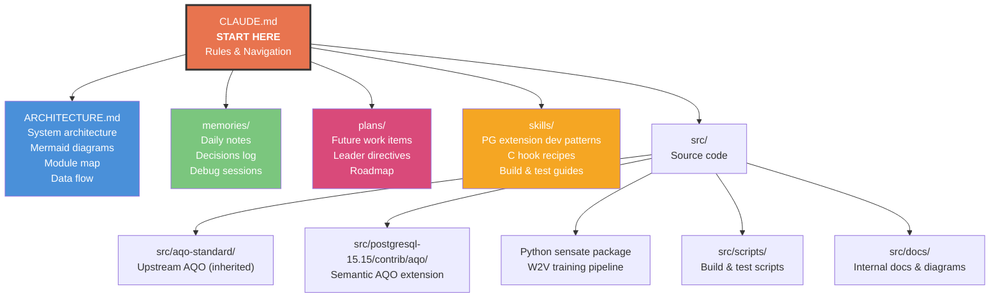

# CLAUDE.md - Agent Navigation & Project Rules

> **Read this file at the start of every conversation.**
> This is the central navigation hub for the Semantic AQO project.

## Project Identity

**Semantic AQO (SAQO)** - A PostgreSQL extension that injects semantic awareness (via Word2Vec embeddings) into the AQO cardinality estimation pipeline, replacing blind k-NN with structure-aware 2-NN interpolation along "caterpillar" trajectories in a 17-dimensional feature space.

## Navigation Map



## File Purposes

| Path | What's Inside | When to Read |
|------|---------------|--------------|
| [`ARCHITECTURE.md`](./ARCHITECTURE.md) | Full system architecture, Mermaid diagrams, module map, data flow, experiment results, known limitations | Understanding how the system works, onboarding, before modifying any module |
| [`memories/`](./memories/) | Daily development notes, key decisions, debug sessions, meeting notes | Retrieving context from past work sessions |
| [`plans/`](./plans/) | Future work items assigned by the team leader, roadmap, milestones | Understanding what comes next, prioritization |
| [`skills/`](./skills/) | PostgreSQL extension development patterns, C hook recipes, Makefile patterns, GUC setup, SPI usage, shared memory, build/test workflows | When writing or modifying C extension code |

## Rules

### General Rules

1. **Always read `CLAUDE.md` first** at the start of every conversation
2. **Read `ARCHITECTURE.md`** before making any code changes to understand the full system
3. **Check `memories/`** for recent context before starting new work - search by date or topic
4. **Check `plans/`** to understand current priorities and leader directives
5. **Consult `skills/`** for PG extension development patterns before writing C code

### Code Rules

6. **Target: PostgreSQL 15** - all C code must be compatible with PG15 APIs
7. **Extension language: C** - the SAQO extension is a native PG C extension
8. **Python is offline only** - the `sensate` package runs offline for W2V training, never at query time
9. **No runtime ML frameworks** - embeddings are pre-loaded as a PG table (`token_embeddings`), lookup only
10. **Build system**: standard PG extension Makefile (`PGXS`)
11. **Test with**: `make check` in the extension directory, plus `src/scripts/04-test-node-context.sh`

### Development Workflow

12. **Recompile after changes**:
    ```bash
    cd src/scripts
    bash 03-recompile-extensions.sh --quick   # AQO only
    bash 03-recompile-extensions.sh            # Full PG + AQO
    ```
13. **Run tests**:
    ```bash
    cd src/postgresql-15.15/contrib/aqo && make check
    bash src/scripts/04-test-node-context.sh
    ```
14. **Server management**:
    ```bash
    sudo -u postgres /usr/local/pgsql/bin/pg_ctl -D /usr/local/pgsql/data start
    sudo -u postgres /usr/local/pgsql/bin/pg_ctl -D /usr/local/pgsql/data stop
    psql -U postgres -d postgres
    ```

### Memory & Documentation Rules

15. **Write a daily note** in `memories/` at the end of each significant work session using format `YYYY-MM-DD-<topic>.md`
16. **Record key decisions** with rationale in memory notes - these are the team's institutional knowledge
17. **Skills are reusable** - when you discover a non-obvious PG extension pattern, save it in `skills/`
18. **Plans are read-only for the agent** - only the leader updates `plans/`; the agent reads and follows them

## Key Architecture Quick Reference

```
Query → Planner Hook → Cardinality Estimator
                        ├── NCE: deparse → mask literals → compute space_hash
                        ├── SOR: load historical vectors from aqo_data[space_hash]
                        ├── WEE: tokenize → W2V lookup → positional weight → 16-dim vector
                        └── 2-NN: concat(semantic_vec, log_sel) → distance search → interpolate
         ↓
       Executor Hook → capture true rows → distance-based merge into aqo_data
```

## Critical Source Files (Our Semantic Layer)

| File | Quick Purpose |
|------|---------------|
| `cardinality_estimation.c` | Main orchestrator: `predict_for_relation()` |
| `path_utils.c` | Safe deparse + on-the-fly embedding |
| `node_context.c` | NCE: clause extraction, normalization, space hash |
| `machine_learning.c` | 2-NN predict + EMA learning |
| `w2v_inference.c` | Load & lookup `token_embeddings` |
| `w2v_embedding_extractor.c` | Tokenize → embed → positional weight → aggregate |
| `sql_preprocessor.c` | SQL tokenizer & classifier |

## Project Links

- **Lab repo**: [vietrion-lab/sematic-aqo-lab](https://github.com/vietrion-lab/sematic-aqo-lab)
- **Production repo**: [vietrion-lab/semantic-aqo-main](https://github.com/vietrion-lab/semantic-aqo-main)
- **Original AQO**: [postgrespro/aqo](https://github.com/postgrespro/aqo)
